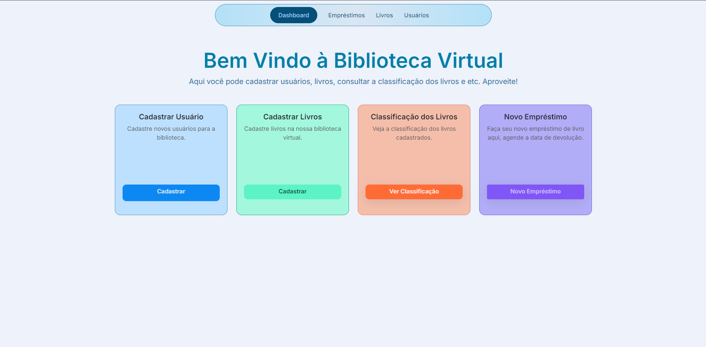

# Facilib - Biblioteca Virtual



Facilib é um sistema de biblioteca virtual desenvolvido com Laravel e Bootstrap, oferecendo funcionalidades como gestão de livros, usuários e empréstimos. Este guia detalha o processo de instalação e configuração do projeto, desde o início até a execução completa.

---

## Índice

1. [Pré-requisitos](#pré-requisitos)
2. [Configuração do Ambiente](#configuração-do-ambiente)
3. [Instalação do Projeto](#instalação-do-projeto)
4. [Configuração do Banco de Dados](#configuração-do-banco-de-dados)
5. [Execução do Projeto](#execução-do-projeto)
6. [Estrutura de Navegação](#estrutura-de-navegação)

---

## Pré-requisitos

Antes de iniciar, você precisa garantir que as seguintes ferramentas estão instaladas no seu ambiente:

- [PHP](https://www.php.net/downloads) (versão 8.0 ou superior)
- [Composer](https://getcomposer.org/download/)
- [Node.js](https://nodejs.org/) (versão 14 ou superior)
- [npm](https://www.npmjs.com/) ou [Yarn](https://yarnpkg.com/)
- [MySQL](https://www.mysql.com/downloads/) ou outro banco de dados compatível
- [Laravel](https://laravel.com/) (versão 9 ou superior) - Framework PHP utilizado no projeto. Ele será instalado automaticamente ao rodar `composer install`.

## Configuração do Ambiente

1. Clone este repositório:
   ```bash
   git clone https://github.com/ricardo006/facilib.git
   cd facilib

2. Crie um arquivo .env

`cp .env.example .env`

3. Atualize os dados de conexão do banco de dados no arquivo .env

DB_CONNECTION=mysql
DB_HOST=127.0.0.1
DB_PORT=3306
DB_DATABASE=nome_do_banco
DB_USERNAME=seu_usuario
DB_PASSWORD=sua_senha

## Instalação do Projeto

1. Instale as dependências PHP usando o Composer:

`composer install`

2. Instale as dependências do front-end:

`npm install`
# ou, se preferir usar Yarn:
`yarn install`


3. Compile os arquivos front-end:

`npm run dev`
# ou, para produção:
`npm run prod`


## Configuração do Banco de dados

1. Gere a chave de criptografia da aplicação:

`php artisan key:generate`

2. Execute as migrações e seeds:

* Preparei seeds que adicionam diversos gêneros e livros.

`php artisan migrate --seed`

* Se preferir, execute de forma individual:

`php artisan db:seed --class=BookSeeder`
`php artisan db:seed --class=GenreSeeder`


## Execução do Projeto

1. Inicie o servidor local:

`php artisan serve`

2. Acesse o projeto em seu nmavegador:

http://localhost:8000/dashboard

## Estrutura de Navegação

O sistema possui as seguintes seções principais:

* Dashboard: Visão geral do sistema
* Empréstimos: Gerenciamento de empréstimos ativos e históricos.
* Livros: Cadastro, edição e visualização de livros.
* Usuários: Gestão de usuários cadastrados no sistema.

## Sobre o Autor

Nome: Ricardo Oliveira 
Linkedin: https://www.linkedin.com/in/ricardo-o-441a22a5/